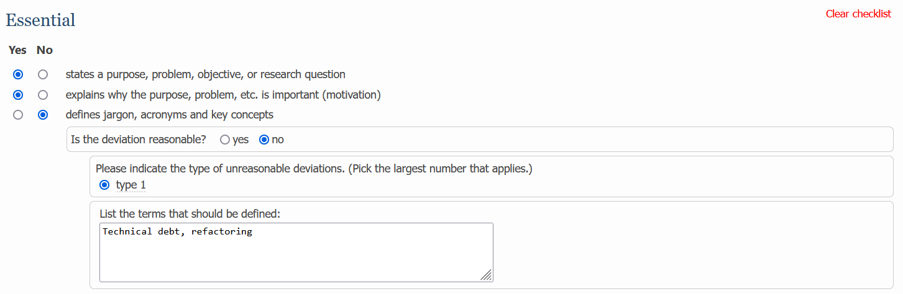

<section id="intro-section">
	

	
		<h1>
			ACM SIGSOFT
			Empirical Standards for Software Engineering
		</h1>
	   	
		

			
The ACM SIGSOFT Empirical Standards are the official evidence standards (models of a community's expectations for conducting and reporting studies) for software engineering research.

		

		
		<a class="page-link" href="https://eschltz.github.io/standardstest/tools/" style="color: white;background-color: #2b4d6f;padding: 10px;border-radius: 5px;font-size: 16px;">Review a paper</a>
	

    

		
	

</section>

<section id="feature-section">
	

		
		<h3>19 empirical standards to choose from</h3>
		
Different kinds of research have different norms, so each common research method has a unique standard

	

	
	

		
		<h3>Checklists for authors and reviewers</h3>
		
Use standards-based checklists to improve your methods, papers, and peer reviews

	

	
	

		
		<h3>Desirable and extraordinary attributes</h3>
		
Standards and checklists clearly differentiate must-haves from exceptional research

	

</section>

<section id="instruction-section">
	<h2>Features of the standards</h2>
	
	

		<h3>Specific attributes</h3>
		
A list of properties the paper should possess, grouped into essential, desirable, and extraordinary

	

	
	

		<h3>General quality criteria</h3>
		
Qualitative and quantitative quality criteria the paper should meet, such as multivocality and generalizability

	

	
	

		<h3>Acceptable deviations</h3>
		
Circumstances where the paper is permitted to deviate from a standard

	

	
	

		<h3>Antipatterns</h3>
		
Common problems with this methodology that papers should avoid

	

	
	

		<h3>Invalid criticisms</h3>
		
Unreasonable arguments against a paper that reviewers should not make

	

	
	

		<h3>Suggested readings</h3>
		
Additional scholarship on the method upon which the standard is based

	

	
	

		<h3>Exemplars</h3>
		
Good examples of the method that authors should emulate

	

	
	
	
		

			
Interactive checklists

			
Interactive checklists based on the standards make peer review more specific, technical, and reliable.
			Customized diagnostics help reviewers make more reasonable and actionable suggestions.

			
			<ul class="benefit-list">
				<li>More effective, transparent peer reviews</li>
				<li>Faster publication times</li>
				<li>Reduced reviewer workload</li>
				<li>Higher-quality papers</li>
			</ul>
		

		
	

	
</section>

<section id="history-section">
	<h2>History</h2>
	
	

		

			
MAY 29 2019

			
At ICSE town hall, SIGSOFT launches the "Improving Paper and Peer Review Quality Initiative"

		

		
		

			
### ## 2019

			
First draft standard

		

		
		

			
OCT 7 2020

			

				Empirical Standards Report made accessible on arXiv <!-- Link to report -->
				<a href="https://arxiv.org/abs/2010.03525">Read the Empirical Standards Report →</a>
			

		

		
		

			
JAN 14 2021

			

				First 9 standards made available on GitHub for public comment <!-- Link to git repo -->
				<a href="https://github.com/acmsigsoft/EmpiricalStandards">Visit GitHub repository →</a>
			

			<!-- https://github.com/acmsigsoft/EmpiricalStandards/blob/bf2bfaecc5a9e7659e66237994da7f93433c1e45/empiricalStandards.md#grounded-theory -->
		

		
		

			
MAY 11 2021

			
First review checklists available on the web

			<!-- https://github.com/acmsigsoft/EmpiricalStandards/commit/3462acf033baa670f4dd869be1d85d642688da51 -->
		

		
		

			
JUNE 2021

			
First recommendation of the standards in a conference (EASE 2021)

		

		
		

			
JUNE 2023

			
Field experiment at EASE showing standards improve reliability

		

		
		

			<h3>Roadmap</h3>
		

		
		

			
EASE experiment and standards published in journal

		

		
		

			
Empirical standards listed on EQUATOR Network

		

	

</section>

Ready to try?

<a class="page-link ready-link" href="https://eschltz.github.io/standardstest/tools/">Try a checklist</a>

